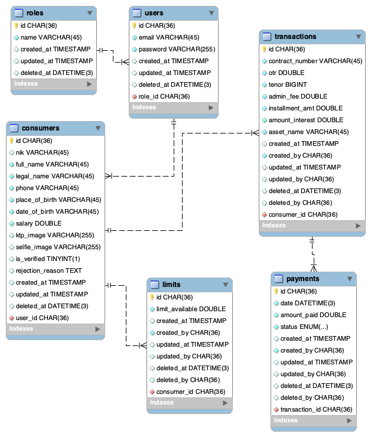
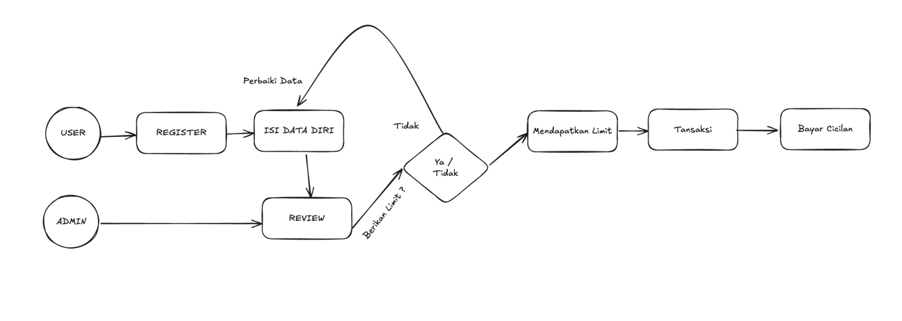

# Dokumentasi Proyek

Link Postman : [Click Disini](https://www.postman.com/xyz-sigmatech/workspace/my-workspace/collection/42721018-6c459cb6-b8c2-45b1-a5e2-16921d290127?action=share&creator=42721018&active-environment=42721018-1bed4e98-154b-4b49-9e13-e4c447011522)

## Prasyarat

### Instalasi MySQL

Pastikan MySQL telah terinstal di sistem Anda. Jika belum, Anda dapat mengunduh dan menginstalnya dari [situs resmi MySQL](https://www.mysql.com/downloads/).

## Struktur Proyek

Proyek ini menggunakan `Makefile` untuk menyederhanakan berbagai tugas build, migrasi, dan eksekusi. Berikut adalah penjelasan perintah utama:

### Perintah Makefile

#### Perintah Umum

- ``: Menginstal dependensi, membangun aplikasi utama, dan menjalankannya.
  ```sh
  make all
  ```
- ``: Membangun binary aplikasi utama.
  ```sh
  make build
  ```
- ``: Membangun ulang binary aplikasi dan menjalankannya.
  ```sh
  make reload
  ```

#### Perintah Migrasi Database

- ``: Membangun dan menjalankan skrip migrasi untuk menerapkan perubahan baru.
  ```sh
  make migrate
  ```

### Detail Tambahan

- **Go Modules** Sebelum menjalankan perintah apa pun, pastikan dependensi Go telah diinstal dengan:

  ```sh
  make mod
  ```

- **Go Wire** Jika ada module baru yang ingin di inject pada dependency google wire, bisa gunakan:

  ```sh
  make wire
  ```

## Menjalankan Aplikasi

1. Bangun binary aplikasi:
   ```sh
   make build
   ```
2. Jalankan aplikasi:
   ```sh
   make run
   ```

## Menjalankan Aplikasi dengan Docker

Proyek ini mendukung Docker untuk mempermudah deployment dan pengembangan. Ikuti langkah-langkah di bawah ini untuk menjalankan aplikasi menggunakan Docker. Pastikan Docker telah diinstal di sistem Anda. Jika belum, unduh dan instal dari [situs resmi Docker](https://www.docker.com/).

### Menjalankan dengan Docker Compose

1. Bangun dan jalankan container:
   ```sh
   make docker-build
   ```
2. Hentikan container:
   ```sh
   make docker-down
   ```
3. Periksa container yang sedang berjalan:
   ```sh
   docker ps
   ```

### Menjalankan Migrasi Database di Docker

Jalankan migrasi di dalam container:
   ```sh
   docker compose exec <container_id> make migrate
   ```

## Catatan

- Pastikan file `.env` telah dikonfigurasi dengan benar sebelum menjalankan Docker.
- `MYSQL_HOST` dalam `.env` harus diset ke `mysql-multifinance` (bukan `localhost`) saat menggunakan Docker.
- Gunakan `docker logs <container_name>` untuk memeriksa log jika terjadi masalah.

## ERD
ERD proyek ini menggambarkan hubungan antar entitas utama dalam sistem, termasuk pengguna, transaksi, dan data finansial. Beberapa entitas utama yang terdapat dalam ERD adalah:


- **Users**: Menyimpan informasi pengguna yang memiliki akun di sistem.
- **Transactions**: Menyimpan data transaksi finansial pengguna.
- **Limits**: Menyimpan informasi limit dari pengguna.
- **Payments**: Menyimpan data pembayaran dan statusnya.

Diagram ERD memberikan gambaran visual bagaimana data saling berhubungan di dalam sistem.


## Flow Aplikasi
Alur kerja aplikasi ini mengikuti tahapan berikut:


1. **Registrasi Pengguna**

    - Pengguna melakukan registrasi untuk membuat akun.

2. **Pengisian Data Diri**

    - Setelah registrasi, pengguna wajib mengisi data diri.

3. **Review oleh Admin**

    - Data pengguna akan direview oleh admin.

4. **Validasi dan Pemberian Limit**

    - Jika data pengguna valid dan memenuhi syarat, maka limit kredit diberikan.
    - Jika tidak memenuhi syarat, pengguna harus memperbaiki data dan mengisi ulang.

5. **Transaksi**

    - Setelah mendapatkan limit, pengguna dapat melakukan transaksi.

6. **Pembayaran Cicilan**

    - Pengguna harus melakukan pembayaran cicilan sesuai jadwal yang ditentukan.

Dengan alur ini, sistem memastikan bahwa hanya pengguna yang memenuhi syarat yang bisa mendapatkan layanan kredit dan melakukan transaksi dengan aman.

