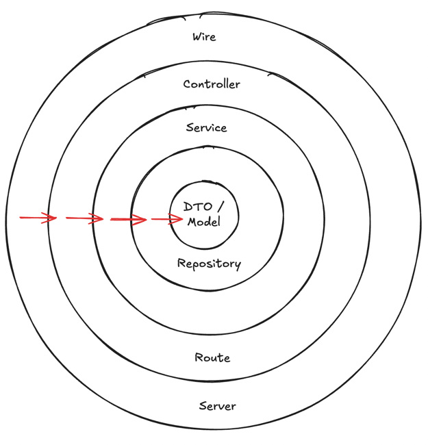

# Dokumentasi Proyek

Link Postman : [Click Disini](https://www.postman.com/xyz-sigmatech/workspace/my-workspace/collection/42721018-6c459cb6-b8c2-45b1-a5e2-16921d290127?action=share&creator=42721018&active-environment=42721018-1bed4e98-154b-4b49-9e13-e4c447011522)

## Prasyarat

### Instalasi MySQL

Pastikan MySQL telah terinstal di sistem Anda. Jika belum, Anda dapat mengunduh dan menginstalnya dari [situs resmi MySQL](https://www.mysql.com/downloads/).

## Struktur Proyek

Proyek ini menggunakan `Makefile` untuk menyederhanakan berbagai tugas build, migrasi, dan eksekusi. Berikut adalah penjelasan perintah utama:

### Perintah Makefile

#### Perintah Umum

- Menginstal dependensi, membangun aplikasi utama, dan menjalankannya.
  
  ```sh
  make all
  ```
- Membangun binary aplikasi utama.
  
- ```sh
  make build
  ```
-  Membangun ulang binary aplikasi dan menjalankannya.
  
  ```sh
  make reload
  ```

#### Perintah Migrasi Database

- Membangun dan menjalankan skrip migrasi untuk menerapkan perubahan baru.
  
  ```sh
  make migrate
  ```

### Detail Tambahan

- **Go Modules** Sebelum menjalankan perintah apa pun, pastikan dependensi Go telah diinstal dengan:

  ```sh
  make mod
  ```

- **Go Wire** Jika ada module baru yang ingin di inject pada dependency google wire, bisa gunakan:

  ```sh
  make wire
  ```

## Menjalankan Aplikasi

1. Bangun binary aplikasi:
   ```sh
   make build
   ```
2. Jalankan aplikasi:
   ```sh
   make run
   ```
3. Jalankan test:
   ```sh
   make test
   ```

## Menjalankan Aplikasi dengan Docker

Proyek ini mendukung Docker untuk mempermudah deployment dan pengembangan. Ikuti langkah-langkah di bawah ini untuk menjalankan aplikasi menggunakan Docker. Pastikan Docker telah diinstal di sistem Anda. Jika belum, unduh dan instal dari [situs resmi Docker](https://www.docker.com/).

### Menjalankan dengan Docker Compose

1. Bangun dan jalankan container:
   ```sh
   make docker-build
   ```
2. Hentikan container:
   ```sh
   make docker-down
   ```
3. Periksa container yang sedang berjalan:
   ```sh
   docker ps
   ```

### Menjalankan Migrasi Database di Docker

Jalankan migrasi di dalam container:
   ```sh
   docker compose exec <container_id> make migrate
   ```

## Catatan

- Pastikan file `.env` telah dikonfigurasi dengan benar sebelum menjalankan Docker.
- `MYSQL_HOST` dalam `.env` harus diset ke `mysql-multifinance` (bukan `localhost`) saat menggunakan Docker.
- Gunakan `docker logs <container_name>` untuk memeriksa log jika terjadi masalah.

## ERD
ERD proyek ini menggambarkan hubungan antar entitas utama dalam sistem, termasuk pengguna, transaksi, dan data finansial. Beberapa entitas utama yang terdapat dalam ERD adalah:


- **Users**: Menyimpan informasi pengguna yang memiliki akun di sistem.
- **Transactions**: Menyimpan data transaksi finansial pengguna.
- **Limits**: Menyimpan informasi limit dari pengguna.
- **Payments**: Menyimpan data pembayaran dan statusnya.

Diagram ERD memberikan gambaran visual bagaimana data saling berhubungan di dalam sistem.


## Flow Aplikasi
Alur kerja aplikasi ini mengikuti tahapan berikut:


1. **Registrasi Pengguna**

    - Pengguna melakukan registrasi untuk membuat akun.

2. **Pengisian Data Diri**

    - Setelah registrasi, pengguna wajib mengisi data diri.

3. **Review oleh Admin**

    - Data pengguna akan direview oleh admin.

4. **Validasi dan Pemberian Limit**

    - Jika data pengguna valid dan memenuhi syarat, maka limit kredit diberikan.
    - Jika tidak memenuhi syarat, pengguna harus memperbaiki data dan mengisi ulang.

5. **Transaksi**

    - Setelah mendapatkan limit, pengguna dapat melakukan transaksi.

6. **Pembayaran Cicilan**

    - Pengguna harus melakukan pembayaran cicilan sesuai jadwal yang ditentukan.

Dengan alur ini, sistem memastikan bahwa hanya pengguna yang memenuhi syarat yang bisa mendapatkan layanan kredit dan melakukan transaksi dengan aman.

## Arsitektur Aplikasi
Arsitektur yang ditampilkan dalam gambar adalah Layered Architecture (Arsitektur Berlapis) untuk aplikasi Golang. Setiap lapisan memiliki tanggung jawab spesifik, yang membantu menjaga modularitas, skalabilitas, dan maintainability aplikasi. Berikut penjelasan tiap layer dari dalam ke luar:


1.    **DTO / Model (Lapisan Inti)**
        - DTO (Data Transfer Object) digunakan untuk pertukaran data antara lapisan aplikasi.
        - Model merepresentasikan struktur data yang digunakan dalam database atau komunikasi antar layanan.

2.    **Repository Layer**
        - Berisi logika untuk berinteraksi dengan database.
        - Menggunakan ORM seperti gorm atau SQL native dengan database/sql atau sqlx.
        - Contoh: fungsi untuk menyimpan, mengambil, memperbarui, dan menghapus data dari MySQL.

3.    **Service Layer**
        - Menyimpan logika bisnis utama.
        - Menghubungkan antara Repository dan Controller.
        - Menggunakan dependensi injection agar lebih fleksibel.

4.    **Controller Layer**
        - Berisi endpoint API yang menangani permintaan HTTP dari klien.
        - Memvalidasi input dan meneruskan ke Service Layer untuk diproses.

5.    **Route Layer**
        - Mendefinisikan rute dan menghubungkan endpoint ke Controller.
        - Contoh framework yang sering digunakan: gin-gonic, echo, atau mux.

6.    **Server Layer**
        - Berisi konfigurasi server dan pengaturan middleware.
        - Menginisialisasi aplikasi dan menjalankan server HTTP.
      
7.    **Wire (Dependency Injection)**
        - Menggunakan Google Wire untuk mengelola dependency injection.
        - Memudahkan pengelolaan dependency antara repository, service, dan controller.

### Aliran Kerja
1. Client mengirim request ke endpoint API.
2. Route mengarahkan request ke Controller yang sesuai.
3. Controller menangani request dan memvalidasi data.
4. Controller memanggil Service untuk logika bisnis.
5. Service memanggil Repository untuk mengambil atau menyimpan data ke database.
6. Repository berinteraksi dengan database MySQL dan mengembalikan hasil.
7. Service mengembalikan data yang sudah diproses ke Controller.
8. Controller mengembalikan response ke client.

### Kelebihan Arsitektur Ini
- ✅ Modular & Terstruktur → Setiap bagian memiliki tanggung jawab sendiri.
- ✅ Scalable → Mudah dikembangkan dengan fitur baru tanpa merusak yang lama.
- ✅ Testable → Mudah diuji karena tiap layer bisa diuji secara terpisah.
- ✅ Dependency Injection (Wire) → Mengurangi ketergantungan langsung antar modul.

Arsitektur ini cocok untuk aplikasi REST API berbasis Golang dengan MySQL dan logging berbasis file. Jika ada tambahan seperti caching atau event-driven processing, bisa ditambahkan ke dalam service atau repository layer.